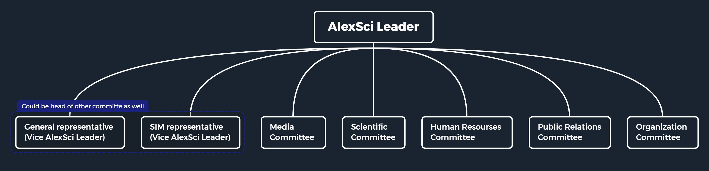

AlexSci Hierarchy & Roles
=========================

ECPC:
-----

*   Egyptian Collegiate Programming Contest, the Regional contest of Egypt, which qualifies teams to participate in ACPC (Africa and Arab Collegiate Programming Championship).

*   مسابقة البرمجة التنافسية المصرية لطلاب الجامعة، المسابقة الإقليمية لمصر، والمؤهلة للمنافسة في البطولة العربية والإفريقية (ACPC).
*   يُعلن عن ميعادها من خلال [صفحة المسابقة](https://www.facebook.com/EgyptCPC/).
*   مكانها بالأكاديمية العربية البحرية للعلوم والتكنولوجيا بأبي قير.

* * *

AlexSci:
--------

*   فريق يمثل المؤسسة التعليمية الخاضع لها (كلية العلوم - جامعة الإسكندرية) والمسجلة على موقع ICPC.. ومن خلال الفريق تعلن المسابقة عن أنشطتها ويكون الكيان الذي يرجع إليه طلاب الكلية للتواصل مع المسابقة أو الاستفسار عن أي شيء يخصها.
*   يُنظم المسابقة الداخلية (التصفيات) المؤهلة إلى المسابقة المصرية (ECPC) في حالة طلب إدارة ECPC إنشاء مسابقة داخلية ويتم الإعلان من خلال صفحات الفريق على مواقع التواصل.
*  [صفحة الفريق على الفيسبوك](https://www.facebook.com/AlexSciCPC/)
*  [قناة الفريق على التيليجرام](t.me/AlexSciCPC)
*  [قناة الفريق على اليوتيوب](https://www.youtube.com/c/AlexSciCPC)

* * *

AlexSci Leader:
---------------

*   طالب من الكلية يمثل ويدير AlexSci ويكون حلقة الوصل بين طلاب الكلية وبين إدارة المسابقة.
*   مسؤول أمام المسابقة عن صحة وسلامة بيانات الفرق المشاركة بالمسابقة من الكلية.

* * *

General departments representative:
-----------------------------------

*   طالب من الأقسام العامة (علوم الحاسب والإحصاء والرياضيات وغيرهم).
*   ممثل الأقسام العامة.
*   حلقة الوصل بين الفريق والأقسام العامة.
*   مساعد ممثل الفريق ويمكن أن يمثل الفريق في حالة غياب أو حدوث أي مكروه لممثل الفريق.
*   يُرجع إليه مع ممثل القسم الخاص في تحديد بعض قرارات الفريق.

* * *

SIM department representative:
------------------------------

*   طالب من القسم الخاص.
*   ممثل القسم الخاص.
*   حلقة الوصل بين الفريق والقسم الخاص.
*   مساعد ممثل الفريق ويمكن أن يمثل الفريق في حالة غياب أو حدوث أي مكروه لممثل الفريق.
*   يُرجع إليه مع ممثل القسم العام في تحديد بعض قرارات الفريق.
    *   في حالة أي خلاف يحدث في الفريق يكون القرار النهائي نتيجة التصويت بين قائد الفريق وممثل القسم العام والقسم الخاص ويؤخذ برأي الغالبية (2 على الأقل من 3) ويُحترم القرار النهائي.

* * *

Scientific Committee Head:
--------------------------

*   ليس شرطًا أن يكون طالب بالكلية.
*   شارك في المسابقة المصرية مرة على الأقل.
*   مسؤول عن إعداد تدريب لطلاب الكلية (بمساعدة أعضاء اللجنة العلمية).
*   مسؤول عن وضع مسائل وإرسالها إلى إدارة المسابقة.
*   مسؤول عن إنشاء مسابقات داخلية بالكلية (للتدريب أو تصفيات مؤهلة للمسابقة المصرية).

* * *

Media Committee Head:
---------------------

*   ليس شرطًا أن يكون طالب بالكلية.
*   مسؤول عن التنسيق بين اللجنة الإعلامية للمسابقة ومعرفة مواعيد الأنشطة للتجهيز والإعلان عنها.
*   مسؤول عن منشورات مواقع التواصل مثل الإعلان عن الأنشطة ومواعيد المسابقة أو المناسبات (مثل الإعلان عن تدريب بالكلية).
*   الرد عن استفسار طلاب الكلية من خلال وسائل التواصل (بالتنسيق مع اللجنة العلمية).
*   تغطية المناسبات والمسابقات وقت إقامتها.
* * *

HR Committee Head:
------------------

*   ليس شرطًا أن يكون طالب بالكلية.
*   مسؤول عن مراجعة بيانات الطلاب المشاركين في المسابقة من الكلية (مثل صورة البطاقة أو البيانات الشخصية لحساب المتسابق على موقع ICPC).
*   بالتنسيق مع ممثل كل قِسم يستخرج بيان قيد جماعي لطلاب القسم (عام أو خاص).
*   مسؤول عن معرفة رأي ومشاكل المتدربين في حالة إقامة تدريب (بمكان أو أونلاين).

* * *

PR Committee Head:
------------------

*   ليس شرطًا أن يكون طالب بالكلية.
*   مسؤول عن العلاقات العامة بين الفريق والمؤسسات الخارجية.
*   مسؤول عن حجز قاعة بالكلية (أو خارجها) للتدريب في حالة إقامة تدريب بمكان.
*   مسؤول التعامل والتنسيق مع الفِرق الأخرى في الكلية وخارجها.

* * *

Organization Committee Head:
----------------------------

*   يٌفضل أن يكون طالب بالكلية (لحجز القاعات بها).
*   مسؤول عن تنظيم الفعاليات أو الندوات.
*   مسؤول عن تنظيم القاعة في حالة التدريب أو في حالة المسابقات الداخلية.

* * *
